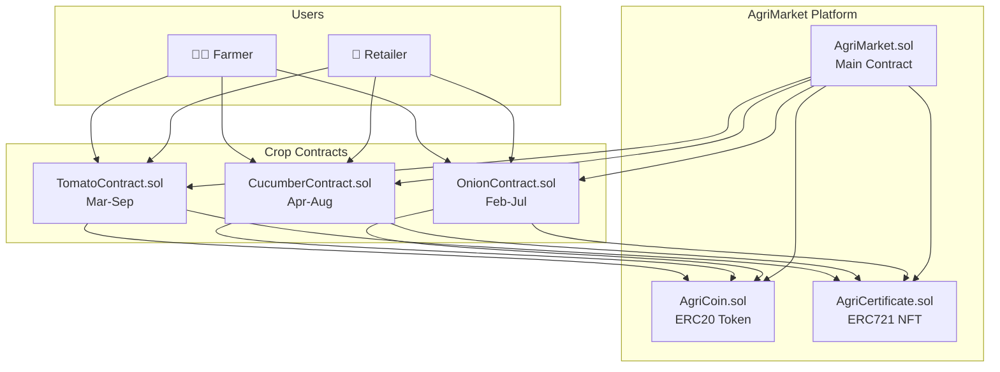

# AgriMarket - Blockchain Agriculture Platform

A decentralized platform connecting farmers and retailers through smart contracts with milestone-based payments and NFT certificates.

## 🌱 Project Overview

AgriMarket enables farmers to sell their crops directly to retailers using blockchain technology. The platform ensures trust through milestone tracking, automatic payments, and digital certificates.

### Key Features
- **Milestone-based payments**: Farmers receive payments as they complete growing stages
- **Digital certificates**: NFT certificates issued for each completed milestone
- **Multiple crops**: Support for tomatoes, cucumbers, and onions
- **Transparent tracking**: All transactions recorded on blockchain

## 🏗️ Architecture



### Smart Contracts
- **AgriCoin.sol** - ERC20 token for platform payments
- **AgriCertificate.sol** - ERC721 NFT certificates for milestones
- **TomatoContract.sol** - Manages tomato growing contracts (Mar-Sep)
- **CucumberContract.sol** - Manages cucumber growing contracts (Apr-Aug)
- **OnionContract.sol** - Manages onion growing contracts (Feb-Jul)
- **AgriMarket.sol** - Main platform contract connecting all services

### Payment Structure
Each crop contract has 3 milestones with different payment distributions:
- **Tomatoes**: 30% → 40% → 30%
- **Cucumbers**: 25% → 45% → 30%
- **Onions**: 35% → 35% → 30%

## 🔄 How It Works

1. **Contract Creation**: Retailer creates a contract specifying crop type, quantity, and total payment
2. **Milestone Completion**: Farmer marks milestones as completed (seeding, growing, harvest)
3. **Verification**: Retailer approves completed milestones
4. **Payment & Certificate**: Automatic payment in AgriCoin + NFT certificate issued
5. **Contract Completion**: All milestones completed = contract fulfilled

## 🛠️ Technology Stack

- **Blockchain**: Ethereum (Sepolia Testnet)
- **Smart Contracts**: Solidity ^0.8.20
- **Standards**: ERC20 (tokens), ERC721 (NFTs)
- **Development**: Hardhat, OpenZeppelin
- **Frontend**: HTML5, CSS3, JavaScript (Web3.js)

## 📁 Project Structure

```
AgriMarket/
├── contracts/          # Smart contracts
│   ├── AgriCoin.sol
│   ├── AgriCertificate.sol
│   ├── TomatoContract.sol
│   ├── CucumberContract.sol
│   ├── OnionContract.sol
│   └── AgriMarket.sol
├── frontend/           # Web interface
├── scripts/            # Deployment scripts
│   └── deploy.js
├── docs/              # Documentation
├── addresses.json     # Deployed contract addresses
└── hardhat.config.js  # Hardhat configuration
```

## 🚀 Deployed Contracts (Sepolia TestNet)

| Contract | Address | Etherscan |
|----------|---------|-----------|
| AgriCoin | `0x98C1D042206d844Ee13b4c41FfA8D59dfd3F85e9` | [View](https://sepolia.etherscan.io/address/0x98C1D042206d844Ee13b4c41FfA8D59dfd3F85e9) |
| AgriCertificate | `0xDC7F26E092Ea61f82f574d8Dd7a2AcC61D861712` | [View](https://sepolia.etherscan.io/address/0xDC7F26E092Ea61f82f574d8Dd7a2AcC61D861712) |
| TomatoContract | `0x056b3Da815124AE59C729FF10AA4e5a140A7B942` | [View](https://sepolia.etherscan.io/address/0x056b3Da815124AE59C729FF10AA4e5a140A7B942) |
| CucumberContract | `0xB84F49B9624350437d6e33EB8ac84A253EEFd8DC` | [View](https://sepolia.etherscan.io/address/0xB84F49B9624350437d6e33EB8ac84A253EEFd8DC) |
| OnionContract | `0x009b332D1d1FF848e64570b2d8b9533a67a58ce6` | [View](https://sepolia.etherscan.io/address/0x009b332D1d1FF848e64570b2d8b9533a67a58ce6) |

## 🎯 Project Goals

- **Trust**: Eliminate intermediaries through smart contracts
- **Transparency**: All transactions visible on blockchain
- **Fair Payment**: Milestone-based payments protect both parties
- **Proof of Quality**: NFT certificates provide verifiable crop history
- **Efficiency**: Direct farmer-to-retailer transactions

## 🚀 Current Status

✅ Smart contracts developed and tested  
✅ Deployed to Sepolia TestNet successfully  
🔄 Frontend development in progress