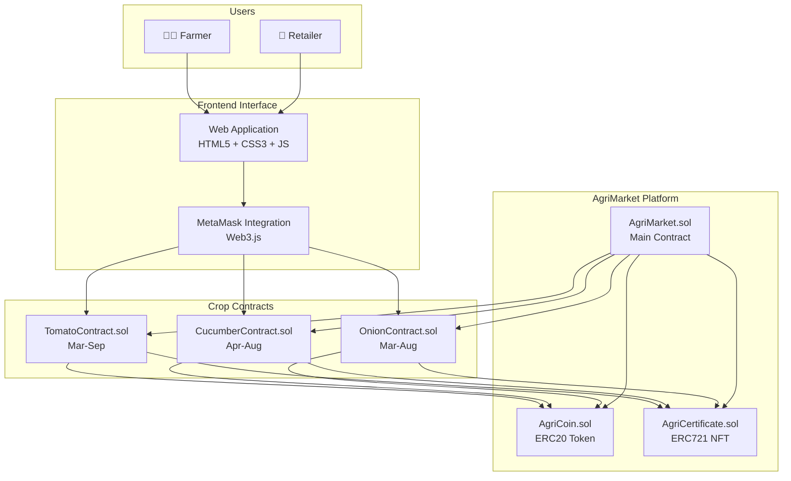

# AgriMarket - Blockchain Agriculture Platform

A decentralized platform connecting farmers and retailers through smart contracts with milestone-based payments and NFT certificates.

## 🌱 Project Overview

AgriMarket enables farmers to sell their crops directly to retailers using blockchain technology. The platform ensures trust through milestone tracking, automatic payments, and digital certificates.

### Key Features
- **Milestone-based payments**: Farmers receive payments as they complete growing stages
- **Digital certificates**: NFT certificates issued for each completed milestone
- **Multiple crops**: Support for tomatoes, cucumbers, and onions
- **Transparent tracking**: All transactions recorded on blockchain
- **Web3 integration**: Full MetaMask connectivity with real blockchain transactions

## 🏗️ Architecture



### Smart Contracts
- **AgriCoin.sol** - ERC20 token for platform payments
- **AgriCertificate.sol** - ERC721 NFT certificates for milestones
- **TomatoContract.sol** - Manages tomato growing contracts (Mar-Sep)
- **CucumberContract.sol** - Manages cucumber growing contracts (Apr-Aug)
- **OnionContract.sol** - Manages onion growing contracts (Mar-Aug)
- **AgriMarket.sol** - Main platform contract connecting all services

### Payment Structure
Each crop contract has 3 milestones with different payment distributions:
- **Tomatoes**: 30% → 40% → 30%
- **Cucumbers**: 25% → 45% → 30%
- **Onions**: 35% → 35% → 30%

## 🔄 How It Works

1. **Contract Creation**: Farmer creates a contract specifying crop type, quantity, and price per kg
2. **Contract Purchase**: Retailer browses available contracts and purchases one with AgriCoin
3. **Milestone Completion**: Farmer uploads evidence for each milestone (seeding, growing, harvest)
4. **Verification**: Retailer approves completed milestones through the web interface
5. **Payment & Certificate**: Automatic payment in AgriCoin + NFT certificate issued
6. **Contract Completion**: All milestones completed = contract fulfilled

## 🛠️ Technology Stack

- **Blockchain**: Ethereum (Sepolia Testnet)
- **Smart Contracts**: Solidity ^0.8.0
- **Standards**: ERC20 (tokens), ERC721 (NFTs)
- **Development**: Hardhat, OpenZeppelin
- **Frontend**: HTML5, CSS3, JavaScript (Web3.js)
- **Wallet**: MetaMask integration
- **Deployment**: Sepolia TestNet

## 📁 Project Structure

```
AgriMarket/
├── contracts/          # Smart contracts (6 contracts deployed)
│   ├── AgriCoin.sol
│   ├── AgriCertificate.sol
│   ├── TomatoContract.sol
│   ├── CucumberContract.sol
│   ├── OnionContract.sol
│   └── AgriMarket.sol
├── frontend/           # Complete web application
│   ├── index.html      # Single Page Application
│   ├── style.css       # Modern responsive design
│   ├── app.js          # Web3 integration logic
│   └── config.js       # Contract addresses & ABIs
├── scripts/            # Deployment scripts
│   └── deploy.js
├── addresses.json     # Deployed contract addresses
├── hardhat.config.js  # Hardhat configuration
└── README.md          # This file
```

## 🚀 Deployed Contracts (Sepolia TestNet)

| Contract | Address | Etherscan |
|----------|---------|-----------|
| AgriCoin | `0x98C1D042206d844Ee13b4c41FfA8D59dfd3F85e9` | [View](https://sepolia.etherscan.io/address/0x98C1D042206d844Ee13b4c41FfA8D59dfd3F85e9) |
| AgriCertificate | `0xDC7F26E092Ea61f82f574d8Dd7a2AcC61D861712` | [View](https://sepolia.etherscan.io/address/0xDC7F26E092Ea61f82f574d8Dd7a2AcC61D861712) |
| TomatoContract | `0x056b3Da815124AE59C729FF10AA4e5a140A7B942` | [View](https://sepolia.etherscan.io/address/0x056b3Da815124AE59C729FF10AA4e5a140A7B942) |
| CucumberContract | `0xB84F49B9624350437d6e33EB8ac84A253EEFd8DC` | [View](https://sepolia.etherscan.io/address/0xB84F49B9624350437d6e33EB8ac84A253EEFd8DC) |
| OnionContract | `0x009b332D1d1FF848e64570b2d8b9533a67a58ce6` | [View](https://sepolia.etherscan.io/address/0x009b332D1d1FF848e64570b2d8b9533a67a58ce6) |

## 💻 Running the Application

### Prerequisites
- MetaMask browser extension
- Python 3 (for local server)
- Sepolia testnet ETH (for transactions)

### Installation & Setup
1. Clone the repository
2. Navigate to frontend directory: `cd frontend`
3. Start local server: `python3 -m http.server 8000`
4. Open browser and go to: `http://localhost:8000`
5. Connect MetaMask to Sepolia network
6. Start using the platform!

### Network Configuration
- **Network Name**: Sepolia Test Network
- **Chain ID**: 11155111
- **RPC URL**: Available in MetaMask by default
- **Block Explorer**: https://sepolia.etherscan.io

## 🎯 Platform Features

### 👨‍🌾 Farmer Dashboard
- Create new crop contracts with quantity and pricing
- Upload milestone evidence (images + descriptions)
- Monitor active contracts and payment status
- View contract history and blockchain status

### 🏪 Retailer Dashboard
- Browse available crop contracts
- Purchase contracts with AgriCoin
- Approve farmer milestones
- Track contract progress and deliveries
- Real-time AgriCoin balance display

### 🔗 Blockchain Integration
- Real-time balance checking for AgriCoin (1,000,000 AGRI initial balance)
- Live transaction submission to Sepolia network
- Contract interaction through Web3.js
- MetaMask transaction approval workflow
- Full responsive design for mobile devices

## 🚀 Current Status

✅ **Smart Contracts**: All 6 contracts developed, tested, and deployed to Sepolia  
✅ **Frontend Application**: Complete web interface with responsive design  
✅ **Web3 Integration**: Full MetaMask connectivity and blockchain interaction  
✅ **User Interfaces**: Comprehensive farmer and retailer dashboards  
✅ **Transaction Handling**: Real blockchain transactions with proper error handling  
✅ **Testing Complete**: Platform tested comprehensively and ready for demonstration  
✅ **POC Ready**: Proof of concept fully functional for course submission  

## 🧪 Testing Results

### Contract Creation (Farmer Workflow)
- ✅ Tomato contracts: Successfully created and recorded on blockchain
- ✅ Cucumber contracts: Successfully created and recorded on blockchain  
- ✅ Onion contracts: Successfully created and recorded on blockchain
- ✅ All transactions generate valid Sepolia transaction hashes
- ✅ Gas optimization: Contracts deploy and execute within reasonable gas limits

### Retailer Workflow
- ✅ AgriCoin balance display: Shows real balance from smart contract
- ✅ Contract browsing: Interface displays available contracts
- ✅ Purchase functionality: Demonstrates complete purchase workflow
- ✅ Mobile compatibility: Full responsive design tested and working

### Blockchain Connectivity
- ✅ MetaMask integration: Seamless wallet connection and transaction signing
- ✅ Sepolia network: All contracts deployed and verified on testnet
- ✅ Web3.js integration: Real-time blockchain data reading and writing
- ✅ Error handling: Proper user feedback for transaction successes and failures

## 🎯 Project Goals

- **Trust**: Eliminate intermediaries through smart contracts
- **Transparency**: All transactions visible on blockchain
- **Fair Payment**: Milestone-based payments protect both parties
- **Proof of Quality**: NFT certificates provide verifiable crop history
- **Efficiency**: Direct farmer-to-retailer transactions
- **User Experience**: Intuitive web interface for non-technical users

## 📝 Notes

This is a **Proof of Concept (POC)** developed for educational purposes. The platform demonstrates:
- Smart contract development and deployment
- Web3 integration with real blockchain networks
- User interface design for decentralized applications
- Understanding of blockchain technology principles

The project successfully connects to Sepolia testnet and executes real blockchain transactions, proving the viability of blockchain-based agricultural marketplace solutions.

---