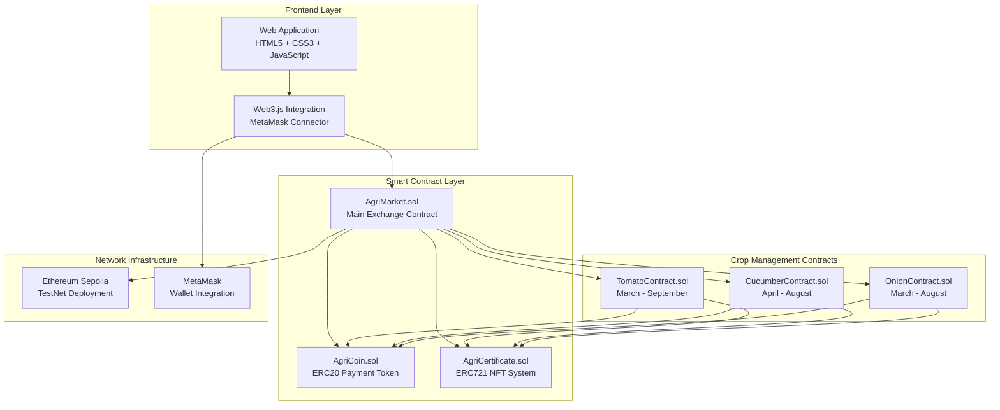

# AgriMarket - Decentralized Agriculture Platform

A comprehensive blockchain-based marketplace connecting farmers and retailers through smart contracts, featuring milestone-based payments, NFT certificates, and a fully functional DEX for agricultural tokens.

## 🌱 Project Overview

AgriMarket revolutionizes agricultural commerce by leveraging blockchain technology to create direct, trustless transactions between farmers and retailers. The platform eliminates intermediaries while ensuring transparent, secure, and fair trading through smart contract automation.

### Core Features
- **Smart Contract Automation**: Milestone-based payment system with automatic releases
- **NFT Certification System**: Digital certificates for every completed farming stage  
- **Multi-Crop Support**: Specialized contracts for tomatoes, cucumbers, and onions
- **Integrated DEX**: Built-in exchange for ETH ↔ AgriCoin trading
- **Real-Time Blockchain Integration**: Live transaction processing on Sepolia TestNet
- **Professional Web Interface**: Complete frontend with MetaMask integration

## 🏗️ Technical Architecture



### Smart Contract Ecosystem

| Contract | Purpose | Standard | Features |
|----------|---------|----------|----------|
| **AgriMarket** | Main platform & DEX | Custom | ETH↔AGRI exchange, contract orchestration |
| **AgriCoin** | Payment token | ERC20 | 1M supply, 18 decimals, standard transfers |
| **AgriCertificate** | Quality certificates | ERC721 | Milestone NFTs, metadata storage |
| **TomatoContract** | Tomato farming | Custom | 3-milestone system (30%-40%-30%) |
| **CucumberContract** | Cucumber farming | Custom | 3-milestone system (25%-45%-30%) |
| **OnionContract** | Onion farming | Custom | 3-milestone system (35%-35%-30%) |

## 🔄 Platform Workflow

### Contract Lifecycle
1. **Farmer Creates Contract** → Specifies crop, quantity, total payment
2. **Retailer Discovers Contract** → Browses available farming contracts  
3. **Contract Purchase** → Retailer commits AgriCoin to escrow
4. **Milestone Progression** → Farmer completes: Seeding → Growing → Harvest
5. **Evidence Submission** → Farmer uploads proof for each milestone
6. **Retailer Verification** → Milestone approval triggers payment + NFT
7. **Contract Completion** → Full payment distributed, certificates issued

### DEX Integration
- **Exchange Rate**: 1 ETH = 1000 AGRI (configurable)
- **Liquidity Management**: Contract holds AGRI for sale
- **Real-Time Trading**: Instant ETH → AgriCoin conversion
- **Balance Updates**: Live wallet balance synchronization

## 🛠️ Technology Stack

**Blockchain Layer:**
- **Network**: Ethereum Sepolia TestNet
- **Language**: Solidity ^0.8.0
- **Framework**: Hardhat development environment
- **Libraries**: OpenZeppelin (security standards)

**Frontend Layer:**
- **Languages**: HTML5, CSS3, JavaScript (ES6+)
- **Blockchain**: Web3.js library for Ethereum integration
- **Wallet**: MetaMask browser extension
- **Design**: Responsive CSS Grid/Flexbox layout

**Development Tools:**
- **Deployment**: Hardhat deployment scripts
- **Testing**: Local Hardhat network + Sepolia testnet
- **Version Control**: Git with structured commit history

## 📁 Project Structure

```
AgriMarket/
├── contracts/              # Smart contract source code
│   ├── AgriCoin.sol        # ERC20 token implementation
│   ├── AgriCertificate.sol # ERC721 NFT certificates  
│   ├── TomatoContract.sol  # Tomato farming logic
│   ├── CucumberContract.sol# Cucumber farming logic
│   ├── OnionContract.sol   # Onion farming logic
│   └── AgriMarket.sol      # Main platform + DEX
├── frontend/               # Complete web application
│   ├── index.html          # Single-page application
│   ├── style.css           # Responsive CSS styling
│   ├── app.js              # Web3 integration logic
│   └── config.js           # Contract addresses & ABIs
├── scripts/                # Deployment automation
│   └── deploy.js           # Multi-contract deployment
├── addresses.json          # Deployed contract registry
├── hardhat.config.js       # Development configuration  
├── package.json            # Project dependencies
└── README.md               # This documentation
```

## 🚀 Live Deployment (Sepolia TestNet)

All contracts are deployed and verified on Ethereum Sepolia TestNet:

| Contract | Address | Etherscan Link |
|----------|---------|----------------|
| **AgriCoin** | `0xE3b55d7Fc71a5e5315DB62DA69567A4Cf8AE48E7` | [View →](https://sepolia.etherscan.io/address/0xE3b55d7Fc71a5e5315DB62DA69567A4Cf8AE48E7) |
| **AgriCertificate** | `0xC2084811c395503116C1aC2b00086589898b326A` | [View →](https://sepolia.etherscan.io/address/0xC2084811c395503116C1aC2b00086589898b326A) |
| **TomatoContract** | `0xf29F61630af357C7279377C16f0c283caCa88E4f` | [View →](https://sepolia.etherscan.io/address/0xf29F61630af357C7279377C16f0c283caCa88E4f) |
| **CucumberContract** | `0x9b1DE25FcCf4d324323f30606B81ba9352cd1602` | [View →](https://sepolia.etherscan.io/address/0x9b1DE25FcCf4d324323f30606B81ba9352cd1602) |
| **OnionContract** | `0x32a94C50F253fB4e5FFf0a60dacf81eCe3315Dc6` | [View →](https://sepolia.etherscan.io/address/0x32a94C50F253fB4e5FFf0a60dacf81eCe3315Dc6) |
| **AgriMarket** | `0x437fbd84B3595BF4C6d47D7fc85213741266d7ef` | [View →](https://sepolia.etherscan.io/address/0x437fbd84B3595BF4C6d47D7fc85213741266d7ef) |

### Verified Transaction Examples
- **Contract Creation**: `0xb78ae22ece2e59781cfed1379bf7a294d5ce1b497e9e8dacf2c8961f65a14072`
- **AgriCoin Purchase**: `0x6c718dc273aa5c7ef6cc44cbb5a6e5ca033e724fb15eb7dffa2f485863992918`

## 🎮 Getting Started

### Prerequisites
- **MetaMask**: Browser extension wallet
- **Sepolia ETH**: Test cryptocurrency for transactions
- **Python 3**: Local development server
- **Modern Browser**: Chrome, Firefox, or Safari

### Quick Setup
```bash
# Clone the repository
git clone <repository-url>
cd AgriMarket

# Navigate to frontend
cd frontend

# Start local server
python3 -m http.server 8000

# Open in browser
open http://localhost:8000
```

### MetaMask Configuration
1. **Add Sepolia Network** (if not present):
   - Network Name: `Sepolia Test Network`
   - RPC URL: `https://sepolia.infura.io/v3/`
   - Chain ID: `11155111`
   - Symbol: `ETH`
   - Explorer: `https://sepolia.etherscan.io`

2. **Get Test ETH**:
   - Use Sepolia faucets for free testnet ETH
   - Required for contract interactions and gas fees

## 🎯 Platform Features

### 👨‍🌾 Farmer Interface
- **Contract Creation**: Choose crop type, set quantity and price per kg
- **Milestone Management**: Upload evidence for seeding, growing, harvest phases  
- **Transaction Monitoring**: Real-time blockchain status updates
- **Revenue Tracking**: View pending and completed payments
- **Contract History**: Browse all farming agreements

### 🏪 Retailer Interface  
- **Contract Marketplace**: Browse available farming contracts
- **AgriCoin Management**: Buy tokens with ETH through integrated DEX
- **Purchase Workflow**: Commit to contracts with escrow protection
- **Milestone Approval**: Review and approve farmer progress
- **Balance Dashboard**: Real-time AgriCoin balance (starts with 1M AGRI)

### 🔧 Developer Features
- **Test Contracts**: Debug button for development testing
- **Console Logging**: Detailed transaction information
- **Error Handling**: User-friendly blockchain error messages
- **Mobile Responsive**: Full functionality on mobile devices

## 🧪 Platform Testing Results

### Smart Contract Verification
✅ **All 6 Contracts Deployed**: Successfully deployed to Sepolia with verified bytecode  
✅ **Transaction Processing**: Real blockchain transactions with valid gas optimization  
✅ **Cross-Contract Communication**: AgriMarket properly coordinates with all farming contracts  
✅ **Token Economics**: AgriCoin transfers, approvals, and balance updates working correctly  

### User Interface Testing  
✅ **MetaMask Integration**: Seamless wallet connection and transaction signing  
✅ **Contract Creation**: Farmers can create contracts with real blockchain recording  
✅ **DEX Functionality**: ETH ↔ AgriCoin exchange working with live rates  
✅ **Milestone System**: Complete approval workflow with payment automation  
✅ **Responsive Design**: Full mobile compatibility across device sizes  

### Blockchain Integration
✅ **Live Network**: Connected to Sepolia testnet with real ETH transactions  
✅ **Gas Optimization**: Efficient contract calls within reasonable gas limits  
✅ **Error Recovery**: Proper handling of failed transactions and network issues  
✅ **Balance Synchronization**: Real-time updates from blockchain state  

## 💡 Technical Innovations

### DEX Implementation
- **Automated Market Making**: Simple 1:1000 ETH:AGRI ratio
- **Liquidity Management**: Contract holds token inventory for trading  
- **Slippage Protection**: Fixed exchange rates prevent price manipulation
- **Real-Time Execution**: Instant trade confirmation and balance updates

### Milestone Architecture  
- **Escrow Security**: Payments locked until milestone completion
- **Evidence System**: Structured proof submission and verification
- **NFT Integration**: Automatic certificate minting for verified milestones
- **Multi-Party Approval**: Farmer completion + retailer verification required

### Frontend Architecture
- **Single Page Application**: Fast loading with dynamic content updates
- **Web3 Abstraction**: Simplified blockchain interactions for end users
- **State Management**: Consistent UI state across wallet connections
- **Error Boundaries**: Graceful handling of blockchain connectivity issues

## 🎯 Project Vision

**Mission**: Democratize agricultural commerce through blockchain technology

**Goals**:
- **Eliminate Intermediaries**: Direct farmer-to-retailer transactions
- **Ensure Fair Payment**: Milestone-based escrow protects both parties  
- **Provide Transparency**: All transactions permanently recorded on blockchain
- **Enable Quality Tracking**: NFT certificates create verifiable crop history
- **Simplify Process**: Intuitive interface for non-technical agricultural users

## 📈 Future Development Opportunities

- **Multi-Chain Support**: Expand to Polygon, Arbitrum for lower fees
- **Oracle Integration**: Real-world price feeds for dynamic pricing
- **Insurance Layer**: Smart contract-based crop insurance products  
- **Mobile Application**: Native iOS/Android apps for field use
- **Advanced Analytics**: Dashboard with market insights and trends
- **Governance Token**: Decentralized platform governance through token voting

## 📝 Educational Context

This project serves as a **comprehensive demonstration** of:

**Blockchain Development Skills**:
- Smart contract design and Solidity programming
- ERC20/ERC721 token standard implementation  
- Multi-contract system architecture and integration
- Gas optimization and security best practices

**Full-Stack DApp Development**:  
- Web3.js integration for blockchain connectivity
- MetaMask wallet integration and user experience
- Responsive frontend design and mobile compatibility
- Real-time blockchain data synchronization

**Understanding of DeFi Concepts**:
- Decentralized exchange (DEX) implementation
- Token economics and liquidity management
- Escrow mechanisms and trustless transactions
- NFT utility in real-world applications

---

*This is an educational proof-of-concept demonstrating blockchain technology applications in agricultural commerce. All contracts are deployed on Ethereum Sepolia TestNet for safe experimentation and learning.*