# AgriMarket DApp - Blockchain Agriculture Platform

A decentralized application connecting farmers and retailers through smart contracts with milestone-based payments and NFT certificates.

## Overview

AgriMarket is a blockchain-based marketplace that enables direct trading between farmers and retailers. The platform uses smart contracts to automate payments based on farming milestones and issues NFT certificates for completed stages. Farmers can create contracts for their crops, and retailers can purchase them using AgriCoin tokens.

### Key Features
- Smart contract automation for farming agreements
- Milestone-based payment system with escrow protection
- NFT certificates for each completed farming stage
- Built-in DEX for ETH ↔ AgriCoin trading
- Support for tomatoes, cucumbers, and onions
- Real-time blockchain integration on Sepolia TestNet

## Architecture

The platform consists of 6 main smart contracts working together:

```mermaid
graph TB
    subgraph "Users"
        F[👨‍🌾 Farmer]
        R[🏪 Retailer]
    end
    
    subgraph "Frontend"
        UI[Web App<br/>MetaMask Integration]
    end
    
    subgraph "Smart Contracts"
        AM[AgriMarket<br/>Main Platform + DEX]
        AC[AgriCoin<br/>ERC20 Token]
        CERT[AgriCertificate<br/>ERC721 NFTs]
        
        subgraph "Crop Contracts"
            TC[TomatoContract]
            CC[CucumberContract] 
            OC[OnionContract]
        end
    end
    
    subgraph "Blockchain"
        ETH[Ethereum Sepolia<br/>TestNet]
    end
    
    F --> UI
    R --> UI
    UI --> AM
    
    AM --> AC
    AM --> CERT
    AM --> TC
    AM --> CC
    AM --> OC
    
    TC --> AC
    CC --> AC
    OC --> AC
    
    TC --> CERT
    CC --> CERT
    OC --> CERT
    
    AM --> ETH
```



**Core Contracts:**
- **AgriMarket** - Main platform contract with integrated DEX
- **AgriCoin** - ERC20 payment token (1M supply)
- **AgriCertificate** - ERC721 NFT system for milestone certificates

**Crop-Specific Contracts:**
- **TomatoContract** - Handles tomato farming
- **CucumberContract** - Handles cucumber farming 
- **OnionContract** - Handles onion farming

Each farming contract manages a 3-milestone system: Planting → Growing → Harvest.

## Workflow

1. **Contract Creation** - Farmer creates a contract specifying crop type, quantity, and price per kg
2. **Contract Discovery** - Retailer browses available contracts on the platform
3. **Purchase** - Retailer commits AgriCoin to the contract (held in escrow)
4. **Milestone Execution** - Farmer completes farming stages and submits evidence
5. **Verification** - Retailer reviews and approves each milestone
6. **Payment & NFT** - Approved milestones trigger automatic payment + certificate minting
7. **Completion** - Contract closes when all milestones are completed

The DEX allows retailers to buy AgriCoin with ETH at a fixed rate (1 ETH = 1000 AGRI).

## Project Structure

```
AgriMarket/
├── contracts/              # Smart contract source files
│   ├── AgriCoin.sol        # ERC20 token
│   ├── AgriCertificate.sol # ERC721 certificates
│   ├── TomatoContract.sol  # Tomato farming logic
│   ├── CucumberContract.sol# Cucumber farming logic
│   ├── OnionContract.sol   # Onion farming logic
│   └── AgriMarket.sol      # Main platform + DEX
├── frontend/               # Web application
│   ├── index.html          # Main interface
│   ├── style.css           # Styling
│   ├── app.js              # Web3 integration
│   └── config.js           # Contract addresses & ABIs
├── scripts/
│   └── deploy.js           # Deployment script
├── addresses.json          # Deployed contract addresses
├── hardhat.config.js       # Hardhat configuration
└── package.json            # Dependencies
```

## Live Deployment

All contracts are deployed on Ethereum Sepolia TestNet:

| Contract | Address |
|----------|---------|
| **AgriCoin** | `0xE3b55d7Fc71a5e5315DB62DA69567A4Cf8AE48E7` |
| **AgriCertificate** | `0xC2084811c395503116C1aC2b00086589898b326A` |
| **TomatoContract** | `0xf29F61630af357C7279377C16f0c283caCa88E4f` |
| **CucumberContract** | `0x9b1DE25FcCf4d324323f30606B81ba9352cd1602` |
| **OnionContract** | `0x32a94C50F253fB4e5FFf0a60dacf81eCe3315Dc6` |
| **AgriMarket** | `0x437fbd84B3595BF4C6d47D7fc85213741266d7ef` |

## Getting Started

### Prerequisites
- MetaMask browser extension
- Sepolia testnet ETH (get from faucets)
- Modern web browser

### Quick Setup
```bash
# Clone and navigate to frontend
git clone https://github.com/AdirGelkop/AgriMarket
cd AgriMarket/frontend

# Start local server
python3 -m http.server 8000

# Open browser
open http://localhost:8000
```

### MetaMask Setup
1. Add Sepolia network (Chain ID: 11155111)
2. Get test ETH from Sepolia faucets
3. Connect wallet to the application

## Technology Stack

**Blockchain:** Solidity ^0.8.0, OpenZeppelin, Hardhat, Ethereum Sepolia  
**Frontend:** HTML5, CSS3, JavaScript, Web3.js  
**Development:** Hardhat deployment, MetaMask integration

---

*This project is developed for educational purposes as part of a blockchain course.*
*All contracts are deployed on Ethereum Sepolia TestNet for safe experimentation and learning.*